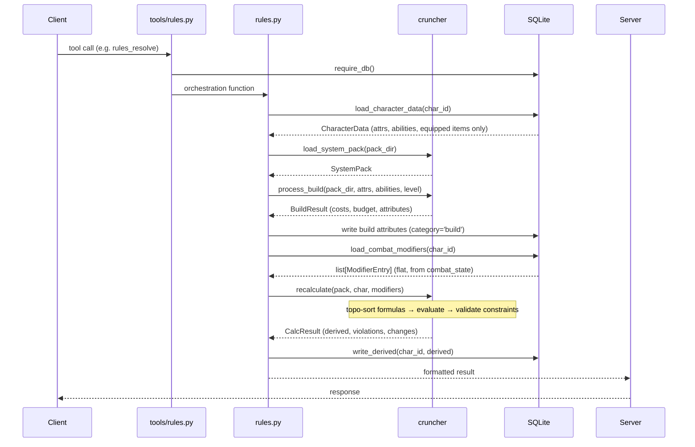
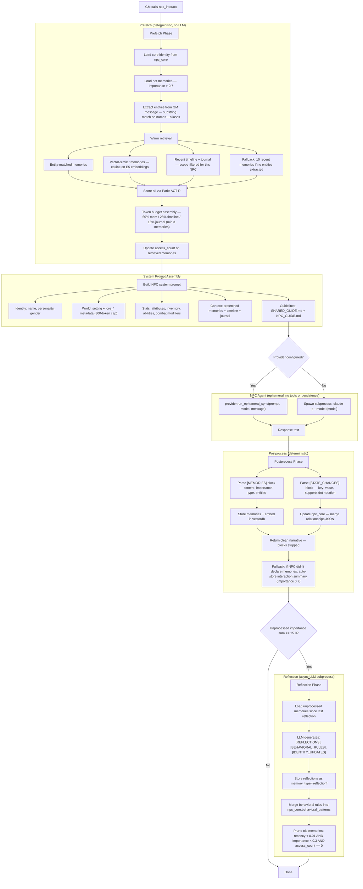
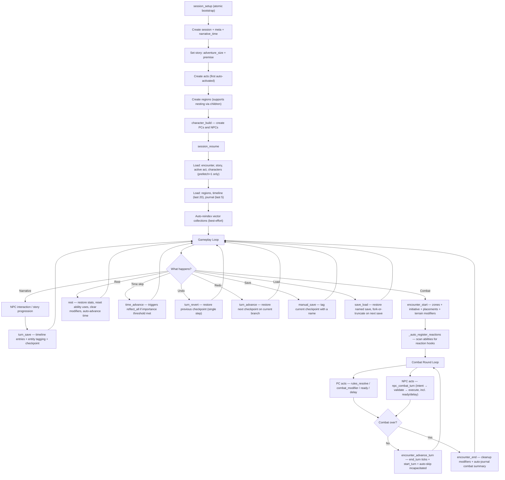
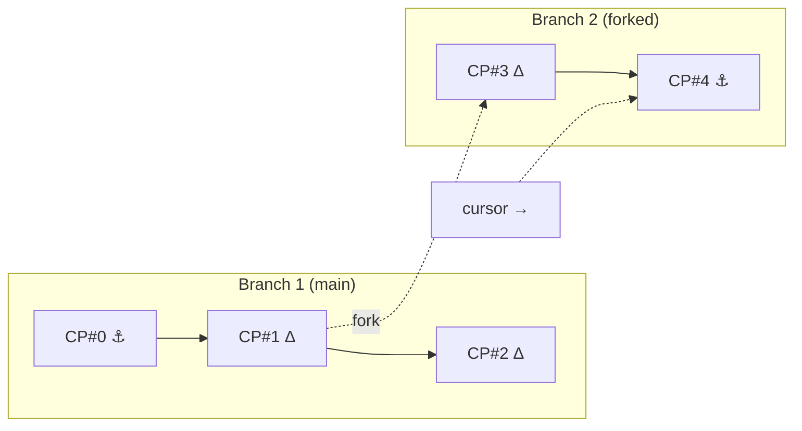
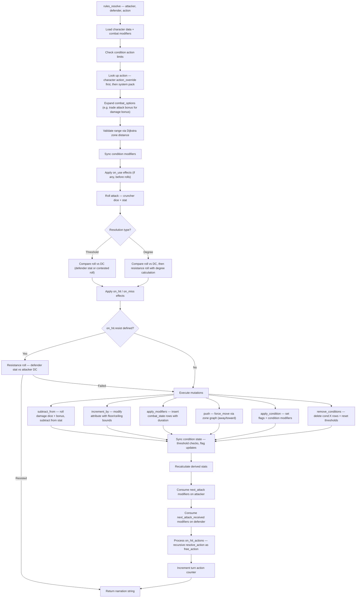
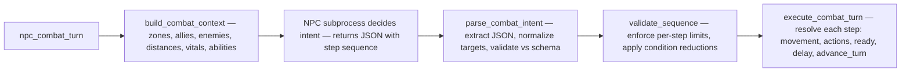
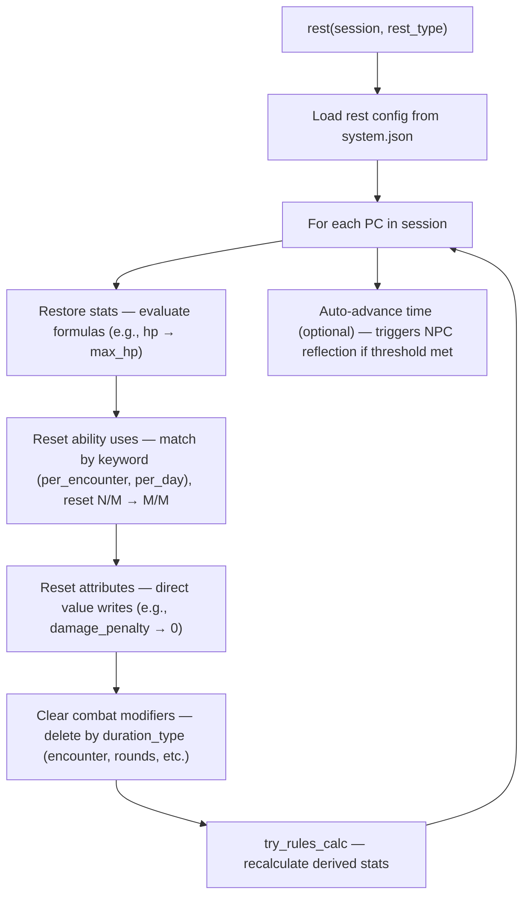
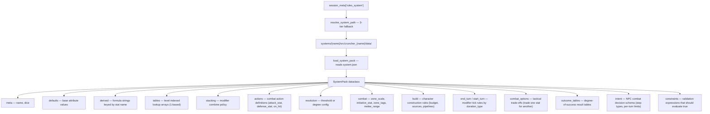
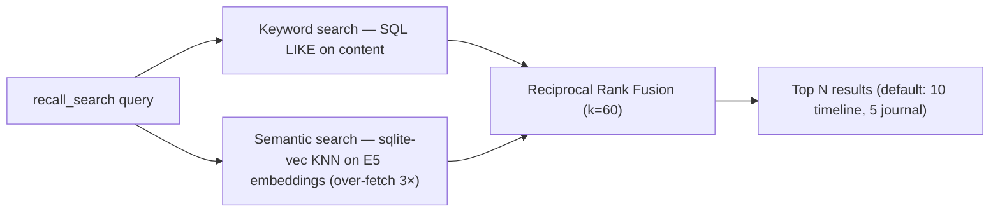

# LoreKit Architecture

LoreKit is an MCP-based TTRPG game engine. It separates **pure computation**
(cruncher) from **state orchestration** (lorekit), with all game rules defined
as **data** in system packs.

```
┌─────────────────────────────────────────────────────────┐
│  Direct MCP Client (Claude Code, Codex, Gemini CLI)     │
└────────────────────────┬────────────────────────────────┘
                         │ MCP (stdio or HTTP)
                         │
┌──────────────────┐     │
│  App Client      │     │
│  (TUI, Discord,  │     │
│   Web)           │     │
└────────┬─────────┘     │
         │ HTTP+SSE      │
         │ or Python API │
┌────────▼───────────────▼────────────────────────────────┐
│  orchestrator.py — GameSession                          │
│  (optional — manages MCP server + GM agent lifecycle)   │
├─────────────────────────────────────────────────────────┤
│  http_server.py — POST /message (SSE), POST /command    │
│  (optional — requires lorekit[server])                  │
└────────────────────────┬────────────────────────────────┘
                         │
┌────────────────────────▼────────────────────────────────┐
│  server.py — MCP entrypoint (FastMCP via _mcp_app.py)   │
│  tools/* — 51 @mcp.tool() across 8 domain modules       │
│  --provider / --model / --campaign-dir CLI args          │
└────────────────────────┬────────────────────────────────┘
                         │
      ┌──────────────────┼──────────────────┐
      ▼                  ▼                  ▼
┌───────────┐   ┌──────────────┐   ┌──────────────┐
│ rules.py  │   │ narrative/*  │   │   npc/*      │
│ combat/*  │   │ session.py   │   │ prefetch.py  │
│encounter.py│  │ story.py     │   │ postprocess  │
│  rest.py  │   │ timeline.py  │   │ reflect.py   │
│character.py│  │ journal.py   │   │ combat.py    │
│           │   │ time.py      │   │ memory.py    │
│           │   │ region.py    │   │              │
└─────┬─────┘   └──────┬───────┘   └──────┬───────┘
      │                │                   │
      ▼                ▼                   ▼
┌─────────────────────────────────────────────────────────┐
│  db.py — SQLite (WAL mode, 22 tables, 21 indexes)      │
└─────────────────────────────────────────────────────────┘
      │                                    │
      ▼                                    ▼
┌──────────────────────────┐  ┌───────────────────────────┐
│  cruncher (standalone,   │  │  support/*                │
│  zero dependencies)      │  │  checkpoint.py            │
│  formulas │ stacking     │  │  recall.py + vectordb.py  │
│  engine   │ build        │  │  export.py                │
│  dice     │ system_pack  │  │  (sqlite-vec, E5-small)   │
└──────────┬───────────────┘  └───────────────────────────┘
           │
           ▼
┌─────────────────────────────────────────────────────────┐
│  System Packs (JSON)                                    │
│  system.json + supporting data files per system          │
└─────────────────────────────────────────────────────────┘
```

---

## Packages

| Package | Role | Dependencies |
|---------|------|-------------|
| **cruncher** | Pure computation engine — formulas, stacking, dice, build, recalculate | None (zero deps, Python 3.12+) |
| **lorekit** | MCP server, DB orchestration, NPC agents, narrative tracking | cruncher, mcp, platformdirs (Python 3.13+) |
| **lorekit[server]** | HTTP+SSE server wrapping the orchestrator | starlette, uvicorn |
| **systems/\*** | Game rules as JSON (one directory per system) | None (data only, separate pyproject.toml each) |

Cruncher takes dataclasses in and returns dataclasses out. It never touches
the database, never does I/O, and knows nothing about any specific RPG system.
All domain knowledge lives in system pack JSON files.

---

## Server Infrastructure

### MCP Server

`_mcp_app.py` creates the single `FastMCP("lorekit")` instance and stores
provider configuration via `configure_provider()` (called by `server.py` at
startup). `server.py` is the entrypoint — it imports `lorekit.tools` (which
triggers all `@mcp.tool()` registrations) and runs the server. CLI args:

- **`--provider`** / **`--model`** — agent provider and model for NPC calls
- **`--campaign-dir`** — sets `LOREKIT_DB_DIR` to the campaign directory
- **`--http`** — streamable-http on port 3847 (used by orchestrator and NPC subprocesses)

Two operating modes:

- **Standalone** (default) — direct MCP server for AI tool users (Claude Code,
  Codex, Gemini CLI). Connects via stdio or HTTP.
- **Managed** — started as a child process by `GameSession` orchestrator, which
  also spawns the GM agent and connects to the MCP server via HTTP.

The embedding model (`intfloat/multilingual-e5-small`) is loaded in the MCP
server subprocess at startup to avoid cold-start penalty on first semantic
search (does not block the HTTP server or clients).

### Tool Modules (`tools/`)

51 MCP tools organized by domain:

| Module | Responsibility |
|--------|---------------|
| `session.py` | Session lifecycle, metadata, setup, resume |
| `character.py` | Character CRUD, build, sheet update, templates |
| `narrative.py` | Story, region, timeline, journal, time, turn save |
| `encounter.py` | Zone-based combat positioning |
| `rules.py` | System info, checks, resolution, modifiers |
| `npc.py` | NPC interaction, memory, reflection, combat turns |
| `utility.py` | Dice, recall search, export, rest |
| `_helpers.py` | Shared helpers: character resolution, DB wrappers, system path resolution |

### Combat Modules (`combat/`)

Action resolution and turn lifecycle, split by responsibility:

| Module | Responsibility |
|--------|---------------|
| `resolve.py` | Main entry point `resolve_action`, threshold/degree strategies |
| `conditions.py` | Condition detection, action limits, modifier sync |
| `effects.py` | On-hit effects, damage, degree effects, contagious |
| `options.py` | Combat options, trade modifiers, team bonuses, pre-resolution |
| `reactions.py` | Reaction policy and dispatch at named hooks |
| `turns.py` | End-of-turn and start-of-turn lifecycle |
| `powers.py` | Power activation, deactivation, alternate switching |
| `area.py` | Area effect resolution and avoidance |
| `helpers.py` | Stat read/write, action lookup, crit detection |

### Database Connection Lifecycle

Every tool acquires and releases its own connection:

```python
db = require_db()
try:
    result = do_work(db, ...)
except LoreKitError as e:
    return f"ERROR: {e}"
finally:
    db.close()
```

`require_db()` auto-creates the database on first use and runs migrations if
needed. Connections are per-tool — no sharing between concurrent requests.

### Character Resolution

Tools accept character by ID, name, or alias. `_resolve_character()` handles:
1. Numeric → use as ID directly
2. String → case-insensitive name lookup in characters table
3. Fallback → check character_aliases table
4. Raises `LoreKitError` on not-found or ambiguous match

### System Pack Resolution

`resolve_system_path(system_name)` uses three-tier fallback:
1. Try importing `cruncher_{system_name}` package → call `pack_path()`
2. Look for `systems/{system_name}/system.json` (direct layout)
3. Look for `systems/{system_name}/src/cruncher_{system_name}/data/system.json` (dev layout)

`project_root()` finds the project root via `LOREKIT_ROOT` env var or by
walking up from the module looking for a `systems/` directory.

### Router Pattern

Multi-action tools (`story`, `region`) use string dispatch:
```python
@mcp.tool()
def story(action: str, ...):
    if action == "set": return story_set(...)
    elif action == "view": return story_view(...)
```

Internal functions use `_run_with_db(fn, *args)` for connection management.

### Error Handling

All errors returned as `"ERROR: ..."` strings — no exceptions escape tools.
Three layers:
1. JSON parse errors caught at tool entry
2. `LoreKitError` caught in try/finally wrapper
3. Module functions handle domain errors internally

---

## Orchestration Layer

The orchestration layer sits above the MCP server, providing a Python API
and HTTP interface for application clients (TUI, Discord, web). It is
optional — direct MCP clients skip it entirely.

### Provider Protocol (`providers/base.py`)

Three types define an agent-agnostic interface:

| Type | Purpose |
|------|---------|
| **`AgentProvider`** | Factory protocol — `spawn_persistent()`, `spawn_ephemeral()`, `run_ephemeral_sync()` |
| **`AgentProcess`** | Running process protocol — `send(message)` yields `StreamChunk`s, plus `stop()` and `alive` |
| **`StreamChunk`** | Typed output fragment — `type` is one of `text`, `tool_use`, `tool_result`, `npc_tool_use`, `error`, `system` |

The Claude provider is built-in (`providers/claude/`). Adding a new provider
means implementing a new module under `providers/` that satisfies
`AgentProvider`. The `load_provider(name)` function in `providers/__init__.py`
loads a provider by name.

### GameSession (`orchestrator.py`)

Public Python API for running a full game session. Manages the MCP server
subprocess and GM agent lifecycle.

| Method | What it does |
|--------|-------------|
| `start()` | Spawns the MCP server (`server.py --http`), loads GM guidelines, writes a temporary `.mcp.json` config to `~/.config/lorekit/.mcp.json`, spawns the GM agent via the configured provider |
| `send(message, verbose)` | Sends a player message to the GM agent, streams back `GameEvent`s |
| `command(cmd, **kwargs)` | Executes a direct MCP tool call (e.g. save, load) via HTTP to the MCP server, bypassing the GM agent |
| `stop()` | Shuts down the GM agent and MCP server |

Constructor params: `campaign_dir` (required), `provider` and `model`
(optional — fall back to config file).

### GameEvent Types

`GameSession.send()` transforms raw `StreamChunk`s into curated `GameEvent`s
for client consumption:

| Event Type | When emitted | Verbose only? |
|------------|-------------|---------------|
| `narration` | Full accumulated text response, emitted at end of stream | No |
| `narration_delta` | Incremental text fragment as it arrives | Yes |
| `tool_activity` | GM agent used an MCP tool | Yes |
| `npc_activity` | An NPC subprocess tool call was detected | Yes |
| `error` | Agent process error | No |
| `system` | System-level message (startup, shutdown) | No |

Default mode emits only `narration`, `error`, and `system`. Verbose mode adds
the delta and activity events for clients that want real-time streaming or
progress indicators.

### HTTP Server (`http_server.py`)

Starlette app that wraps `GameSession` as an HTTP+SSE API. Requires the
`lorekit[server]` optional extra (starlette + uvicorn).

| Endpoint | Method | Request | Response |
|----------|--------|---------|----------|
| `/message` | POST | `{"text": "...", "verbose": false}` | SSE stream of `{"type": "...", "content": "..."}` events |
| `/command` | POST | `{"cmd": "manual_save", "name": "checkpoint-1"}` | `{"result": "..."}` |

CLI entry point: `lorekit serve --campaign-dir /path [--provider X] [--model Y] [--port 8765]`

### Configuration (`config.py`)

Platform-standard TOML config using `platformdirs.user_config_dir("lorekit")`.

```toml
[agent]
provider = "claude"
model = "sonnet"

[server]
port = 8765
```

Override chain: constructor params (highest priority) > config file > defaults.
The config file location follows OS conventions (`~/.config/lorekit/config.toml`
on Linux, `~/Library/Application Support/lorekit/config.toml` on macOS).

---

## Core Flow: Tool Call → Computation → DB

Every rules-related tool follows the same pattern:



### Auto-Recalculation

`try_rules_calc(db, char_id)` is the single entry point all write-side
functions call after modifying attributes or modifiers. It no-ops gracefully
if the session has no `rules_system` configured. Called automatically by:
`character_build`, `character_sheet_update`, `rules_resolve`, `rest`,
`combat_modifier`, `encounter_start`, `encounter_move`, `encounter_end`.

---

## Cruncher Internals

### Formula Engine (`formulas.py`)

Hand-rolled recursive-descent parser and evaluator. Supports arithmetic,
comparisons, conditionals, and built-in functions.

```
String formula → tokenize → parse (AST) → evaluate(ctx) → result
```

**Built-in functions:** `floor`, `ceil`, `abs`, `max`, `min`, `sum`,
`table(name, index)`, `per(value, step)`, `ratio(ranks, cost)`,
`if(cond, then, else)`

**FormulaContext** holds `values` (variable lookups) and `tables` (1-based
arrays from system pack).

### Modifier Stacking (`stacking.py`)

Resolves overlapping modifiers using a configurable policy:

```
list[ModifierEntry] + StackingPolicy → {stat: net_value}
```

**Policy fields:**
- `group_by` — how to bucket modifiers (`"bonus_type"`, `"source"`, or `None`)
- `positive` / `negative` — combine rule per bucket (`"max"`, `"sum"`, `"min"`)
- `overrides` — per-group exceptions (e.g. untyped always stacks)

Each system pack defines its own stacking policy. For example, one system
might group by bonus type and take the highest positive, while another groups
by source and sums everything.

`decompose_modifiers()` is an audit function that shows which modifiers
survive stacking and which are suppressed.

### Recalculation Engine (`engine.py`)

```
SystemPack + CharacterData + modifiers → CalcResult
```

1. Build FormulaContext from character attributes + system defaults
2. Collect `bonus_*` attributes as ModifierEntry objects
3. Resolve stacking (if policy defined)
4. Topologically sort derived stat formulas (Kahn's algorithm)
5. Evaluate formulas in dependency order, feeding results back into context
6. Validate constraints against final context
7. Compute diff (old → new values)

Circular dependencies raise `CruncherError`. Failed formulas logged as
`"ERROR: ..."` in CalcResult and skipped during `write_derived()`.

### Build Engine (`build.py`)

Data-driven character construction. Must run **before** `recalculate()` so
derived formulas can reference build values. Each build rule type has its
own handler:

| Rule Type | What It Does |
|-----------|-------------|
| **ranked_purchase** | Sum attribute keys × cost_per_rank (skills, defenses) |
| **source** | Load from external JSON — single select, multiple match, equipped items |
| **pipeline** | Multi-stage cost calculation for powers (base → extras → flaws → total) |
| **array** | Alternate/dynamic power variants (flat cost per slot) |
| **sub_budget** | Secondary point pools derived from primary stats |
| **budget** | Total point pool formula |

Source rules support `{variable}` template expansion in file paths
(e.g., `classes/{class}.json`), write maps (copy fields from source to
attributes), progressions (level-indexed tables), and effect aggregation.

Pipeline rules process structured JSON from ability descriptions through
multi-stage formulas with modifier groups (extras, flaws), feeds (stat
contributions), and per-rank effects.

### Dice (`dice.py`)

Standard tabletop notation: `[N]d<sides>[kh<keep>][+/-<mod>]`

Uses `secrets.randbelow()` for cryptographic randomness. Returns rolls, kept
dice, modifier, total, and natural value (for single-die crit detection).

---

## Database Layer

### Schema

22 tables in SQLite with WAL mode and foreign keys enabled. Cascade deletes
flow from sessions down to all child state. 21 composite indexes for query
performance.

### Session & Metadata

```
sessions (id, name, setting, system_type, status, created_at, updated_at)
    │
    ├── session_meta (session_id, key, value)  [UNIQUE session_id+key]
    │   Keys: rules_system, narrative_time, last_gm_message,
    │         lore_* (world knowledge, 800-token cap in NPC prompts),
    │         cursor_checkpoint_id, cursor_branch_id
    │
    ├── stories (session_id, adventure_size, premise)  [UNIQUE session_id]
    │   └── story_acts (session_id, act_order, title, description, goal, event, status)
    │       Status flow: pending → active → completed
    │
    └── regions (session_id, name, description, parent_id)  [self-referential hierarchy]
```

### Characters

```
characters (id, session_id, name, gender, level, status, type, prefetch, region_id)
    │   type: pc | npc
    │   status: alive | defeated | disabled
    │   prefetch: 1 = included in session_resume (PCs default 1, NPCs default 0)
    │   region_id: FK to regions (SET NULL on delete)
    │
    ├── character_attributes (character_id, category, key, value)  [UNIQUE char+cat+key]
    │   Categories: stat, derived, build, identity, system, internal,
    │               action_override, movement_mode, condition_flags,
    │               active_alternate, reaction_policy
    │   All values stored as TEXT — callers parse/convert as needed
    │
    ├── character_inventory (character_id, name, description, quantity, equipped)
    │   [UNIQUE char+name]
    │
    ├── character_abilities (character_id, name, description, category, uses, cost)
    │   [UNIQUE char+name]
    │   uses: "at_will" | "1/day" | "0/3 per_encounter" etc.
    │   description: plain text or JSON (for structured powers)
    │
    └── character_aliases (character_id, alias)  [UNIQUE char+alias]
```

### Combat State

```
combat_state (character_id, source, target_stat, modifier_type, value,
              bonus_type, duration_type, duration, save_stat, save_dc,
              applied_by, metadata)  [UNIQUE char+source+target_stat]
    Sources: "ability:X", "cond:X", "zone:X:tag", "equipment:X"
    Duration types: encounter, rounds, condition, reaction, sustained,
                    concentration, next_attack, next_attack_received,
                    until_escape, until_next_turn, readied
    metadata: JSON for reaction hooks, contagious flags, homing retries

encounter_state (session_id, status, round, initiative_order, current_turn)
    │   status: active | ended
    │   initiative_order: JSON array of character IDs
    │   current_turn: index into initiative_order
    │
    ├── encounter_zones (encounter_id, name, tags)  [UNIQUE enc+name]
    │   tags: JSON array (e.g. ["difficult_terrain", "cover", "fire"])
    │
    ├── zone_adjacency (zone_a, zone_b, weight)  [PK zone_a+zone_b]
    │   Bidirectional weighted edges
    │
    └── character_zone (encounter_id, character_id, zone_id, team)  [PK enc+char]
```

### NPC State

```
npc_memories (session_id, npc_id, content, importance, memory_type,
              entities, narrative_time, access_count, last_accessed,
              source_ids)
    Types: experience, observation, relationship, reflection
    importance: 0.0–1.0 float
    entities: JSON array of referenced character/region names
    access_count / last_accessed: usage tracking for scoring

npc_core (session_id, npc_id, self_concept, current_goals,
          emotional_state, relationships, behavioral_patterns)
    [UNIQUE session+npc]
    relationships: JSON object
    2000-char cap per field
```

### Timeline, Journal & Indexing

```
timeline (session_id, entry_type, content, summary, narrative_time, scope)
    entry_type: narration | player_choice
    scope: participants | region | all | gm
    summary: used for semantic search indexing (not full content)

journal (session_id, entry_type, content, narrative_time, scope)
    entry_type: event | combat | discovery | npc | decision | note

entry_entities (source, source_id, entity_type, entity_id)
    [UNIQUE source+source_id+entity_type+entity_id]
    Links timeline/journal entries to characters/regions
    Auto-populated by turn_save via NPC name extraction

embeddings (source, source_id, session_id, npc_id, content)
    [UNIQUE source+source_id]
    + vec_embeddings (virtual table, sqlite-vec, float[384])

checkpoint_branches (session_id, parent_branch_id, fork_checkpoint_id)
    Tree structure: each branch knows its parent branch and fork point

checkpoints (session_id, branch_id, parent_id, name, timeline_max_id, journal_max_id, snapshot, is_anchor)
    branch_id: which branch this checkpoint belongs to
    parent_id: previous checkpoint in the chain (for delta resolution)
    name: NULL for auto-saves, player-visible string for manual saves
    snapshot: zlib-compressed BLOB (full snapshot if is_anchor=1, row-level delta otherwise)
    is_anchor: 1 = full snapshot, 0 = delta relative to parent
```

### Migration System

Three migration types, all idempotent:

1. **ADD_COLUMN_MIGRATIONS** — `ALTER TABLE ADD COLUMN` checked via
   `PRAGMA table_info()`. Fast, runs on every DB open if needed.
2. **DROP_COLUMN_MIGRATIONS** — `ALTER TABLE DROP COLUMN` for removed fields.
3. **CASCADE_MIGRATIONS** — Full table recreation with correct `ON DELETE CASCADE`
   and `UNIQUE` constraints. Detected by checking if `character_inventory` DDL
   contains `ON DELETE CASCADE`. Tables recreated in dependency order via
   backup → drop → create → insert → cleanup.

`init_schema()` creates fresh databases. `_run_migrations()` upgrades existing
ones. Both are called transparently by `require_db()`.

---

## NPC Pipeline

NPCs are autonomous agents with persistent memory and evolving personality.
The pipeline separates deterministic context assembly from LLM generation.



### NPC Subprocess Details

NPC calls route through the configured provider when one is set, with a
legacy subprocess fallback:

- **Provider path** — `provider.run_ephemeral_sync(system_prompt, model, message)`.
  Uses the `AgentProvider` loaded from `_mcp_app.get_provider_name()`. The
  provider handles process spawning, output parsing, and cleanup internally.
- **Legacy path** — direct `claude` CLI subprocess (fallback when no provider
  is configured). Spawns an ephemeral process with stream-json output parsing.

```
claude -p --verbose --output-format stream-json --no-session-persistence
       --permission-mode bypassPermissions --tools "" --disable-slash-commands
       --model {model} --system-prompt {prompt} {message}
```

Four call sites use this dual-path pattern:

| Call site | Module | Purpose |
|-----------|--------|---------|
| `npc_interact` | `tools/npc.py` | Free-form NPC conversation |
| `npc_combat_turn` | `tools/npc.py` | NPC combat intent generation |
| `query_npc_reaction` | `npc/combat.py` | YES/NO reaction decision |
| `_call_llm` | `npc/reflect.py` | Reflection and memory synthesis |

Shared behavior across both paths:

- **No tools** — NPCs are pure narrative agents; all context is pre-fetched
- **No persistence** — each interaction is independent
- **Model selection** — configurable per NPC via `character_attributes["system"]["model"]`
- **120-second timeout** — errors returned as strings, never crash the server
- **Output parsing** — stream-json lines parsed for text blocks; logged to `data/lorekit.log`

### Memory Scoring (Park+ACT-R)

Each memory gets a composite score from three signals:

- **Recency**: `0.995 ^ hours_since_creation` — exponential decay (~38 days to 0.01)
- **Importance**: `0.0–1.0` — assigned at creation
- **Relevance**: cosine similarity between query embedding and memory embedding

All three are normalized and summed with equal weight (plus optional noise).

### Memory Pruning

During reflection, old memories are pruned when all three conditions are true:
- Recency score < 0.01 (~38+ in-game days old)
- Importance < 0.3
- access_count == 0 (never retrieved for context)

### Scope Filtering

Timeline and journal entries have scope tags that control NPC visibility:

| Scope | NPC sees it when... |
|-------|-------------------|
| `all` | Always |
| `participants` | NPC is tagged in `entry_entities` |
| `region` | NPC's region is tagged in `entry_entities` |
| `gm` | Never |

---

## Session Lifecycle



### session_setup (Atomic Bootstrap)

Creates an entire game session in one call:
1. Session row + metadata key-value pairs
2. Narrative time (ISO 8601)
3. Story with adventure_size + premise
4. Acts (first act auto-activated to `status='active'`)
5. Regions with support for nested `children` arrays

### session_resume (State Assembly)

Assembles the full game state for resuming play:
1. **Save count** — shows number of named saves if any exist
2. **Active encounter** — shows status HUD if combat is in progress
3. **Session + metadata + narrative time**
4. **Story + active act**
5. **Characters** — only those with `prefetch=1` (PCs by default, companion NPCs opt-in)
6. **Regions, timeline (last 20), journal (last 5)**
7. **Auto-reindex** — rebuilds vector embeddings (best-effort, exceptions silently caught)

---

## Checkpoint System

Branching checkpoint system with zlib compression, row-level delta encoding,
and a player-facing save/load UX.



### Two Layers

- **Auto-save** — silent checkpoint every `turn_save`. The player never sees these.
  Used for undo/redo (`turn_revert` / `turn_advance`).
- **Manual save** — player explicitly asks to save. Gets a name, shows up in `save_list`.
  Under the hood, a manual save is a checkpoint with `name IS NOT NULL`.

### Branching

Saving after a revert uses **smart truncation**: if the old path has named saves
ahead, it **forks** into a new branch (preserving the old path). If no named
saves exist ahead, the old checkpoints are **truncated** (deleted).

- `checkpoint_branches` table tracks the tree structure (parent branch + fork point)
- `get_branch_history()` computes the full ordered checkpoint list for any branch,
  including inherited ancestors from parent branches
- `cursor_checkpoint_id` + `cursor_branch_id` in session_meta track position

### Compression & Deltas

Snapshots are stored as **zlib-compressed BLOBs**. The anchor policy decides
whether to store a full snapshot or a row-level delta:

1. **Fork points** — always full snapshot (anchor). Promoted on fork creation.
2. **Count cap** — full snapshot every 20 checkpoints on the same branch.
3. **Size threshold** — if delta >= 50% of full snapshot size, store full instead.
4. **Otherwise** — store row-level delta relative to parent checkpoint.

`reconstruct_state()` resolves delta chains by walking `parent_id` to the
nearest anchor and applying deltas forward.

### Operations

**turn_save:**
1. Add timeline entries (player_choice before narration for ordering)
2. Auto-tag entities in entries (NPC name extraction from text)
3. Snapshot all mutable state, compress, apply anchor policy
4. If cursor is behind tip: fork if named saves exist ahead, else truncate old checkpoints

**turn_revert / turn_advance:**
- Move cursor back/forward within the current branch's history
- Reconstruct target state (resolving deltas if needed)
- Restore via FK OFF → delete all current → re-insert → FK ON → rebuild embeddings

**save_load:**
- Find the named checkpoint, reconstruct its state, restore it
- Move cursor to that checkpoint's branch — next `turn_save` will fork or truncate (see branching rules above)

**manual_save:**
- Tag the current checkpoint with a name (or create a new one if state has changed)

### Snapshot Contents

Every checkpoint captures all mutable state: session_meta, characters (with
all attributes, inventory, abilities, aliases), encounter state (zones,
adjacency, positions), stories + acts, regions, timeline, journal,
entry_entities, npc_memories, npc_core. During restore, vector embeddings
are rebuilt from the restored timeline summaries and journal content.

---

## Combat System

### Action Resolution



### Threshold vs Degree Resolution

The engine supports two resolution types, selected per system pack:

**Threshold** — roll + attack_stat vs defense_value. On hit: roll damage dice,
subtract directly from a stat. Supports critical hits via natural roll or
degree shift, miss chance (concealment), and damage multipliers.

**Degree** — same hit check, but on hit a resistance roll determines the
degree of failure (1–4, based on margin ÷ degree_step). Outcomes are looked up
from configurable outcome tables. Supports team bonuses, DC scaling based on hit margin, cap checks, and
reaction hooks.

### Reaction Hooks

Reactions are checked at four points during action resolution:
`before_attack` (Interpose — substitute defender), `replace_defense` (Deflect),
`after_hit`, and `after_miss` (Riposte — free counter-attack).

Each reaction respects per-character **reaction policies** (`active`, `inactive`,
`ask`) stored in `character_attributes`. NPCs with `ask` policy are queried via
a lightweight Claude subprocess for a YES/NO tactical decision.

### On-Hit Resistance

Actions can declare `on_hit.resist` — an immediate resistance roll before any
on_hit effects apply. The defender rolls using the best of one or more stats
against a DC derived from the attacker's stat + offset. If the defender passes,
all remaining on_hit effects (damage, modifiers, push, conditions) are skipped.

### Condition System

Conditions are dual-synced for independent mechanical and formula access:

1. **combat_state rows** — `source="cond:<name>"` with mechanical modifiers
   (e.g., a condition that applies an attack penalty)
2. **character_attributes** — `category="condition_flags"`, `key="is_<name>"`,
   `value="1"` (readable by derived formulas)

**Condition expansion** handles combined conditions recursively:
e.g., a combined condition expands to its component conditions, each with
extra_modifiers from each component.

**Condition activation** detects conditions from two sources:
- Explicit `cond:X` entries in combat_state
- Attribute threshold checks (e.g., if a stat crosses a threshold, activate a condition)

**Condition cancellation** — active conditions can declare `cancels_duration_types`
(e.g., stunned cancels `sustained` and `concentration` modifiers).

### Turn Tick System

**End-of-turn** (`end_turn()`) processes modifier durations:

| Tick Action | What It Does |
|-------------|-------------|
| **decrement** | Subtract 1 from duration, remove at 0 |
| **check** | Roll save vs DC, remove on success or failure (configurable) |
| **escape_check** | Roll attacker's escape_stat vs defender's DC to break free |
| **modify_attribute** | Apply delta to attribute each round (e.g., poison worsening) |
| **auto_save** | Roll save, apply degree effect on success or failure |
| **worsen** | Increment degree tracker up to max_degree |

**Start-of-turn** (`start_turn()`) processes:

| Tick Action | What It Does |
|-------------|-------------|
| **remove** | Delete all modifiers of this duration_type |
| **warn** | Emit reminder about sustained effects needing free action |
| **replenish** | Reset duration to value (e.g., reaction count back to 1) |
| **retry_action** | Re-attempt homing attacks, decrement retries on miss |

### Alternate Switching Limits

During active encounters, `switch_alternate()` enforces a per-turn limit from
the system pack's `combat.alternate_switching.max_per_turn` config. A
`_switches_this_turn` counter (category `internal`) is incremented on each
switch and reset by `advance_turn()`. The `_bypass_limit=True` flag skips
enforcement for internal resets (e.g., encounter_end resetting arrays to base).

### Zone-Based Positioning

Encounters use abstract zones connected by weighted edges.

**Movement cost:** Dijkstra shortest path on adjacency graph, multiplied by
terrain tags (e.g., `difficult_terrain` → `movement_multiplier: 2`).

**Terrain modifiers:** Zone tags insert `combat_state` rows with
`source="zone:{name}:{tag}"` and `duration_type='encounter'`. Automatically
applied when entering a zone, removed when leaving.

**Range validation:** Melee checks zone hops, ranged checks `distance × zone_scale`
vs weapon range.

**AOE targeting:** BFS on adjacency graph to collect all characters within N
zone hops from center.

**Force movement (push):** Finds neighbor zone farthest from attacker via
distance comparison, moves character hop by hop. Stops at graph boundary.

### Encounter Lifecycle

**encounter_start:**
1. Optional template loading from system pack's `encounter_templates`
2. Initiative ordering: auto-roll `d20 + initiative_stat` with random tiebreaker,
   or manual roll values
3. Zone creation with tags (JSON arrays)
4. Adjacency: explicit edges or auto-generated linear chain
5. Character placement + terrain modifier application
6. `_auto_register_reactions()` — scans abilities for reaction hooks, pre-registers
   as combat_state entries with `duration_type='reaction'`

**encounter_advance_turn:**
1. End-turn processing (modifier ticks, action/switch counter reset)
2. Advance initiative index (wrap to round+1 at end)
3. Auto-skip incapacitated characters (recursive)
4. Start-turn processing
5. Show zone context + condition reminders for new character

**encounter_ready / encounter_execute_ready:**
- `ready_action()` stores the action, trigger, and optional target as a
  `duration_type='readied'` combat_state row, then advances the turn
- `execute_ready()` fires the readied action as a free action during another
  character's turn, resolves it via `resolve_action()`, and consumes the row
- Unused readied actions are cleaned up at the start of the character's next turn

**encounter_delay / encounter_undelay:**
- `delay_turn()` removes the character from initiative order, marks them with
  `_delayed` attribute, and starts the next character's turn (no end-turn
  processing on the delaying character since they didn't act)
- `undelay()` inserts the character back into initiative just before the
  current character and starts their turn
- Delayed characters appear in `encounter_status` under a separate "Delayed" line

**encounter_end:**
1. Collect summary (participants, defeated, final vitals)
2. Remove all encounter/rounds/concentration modifiers
3. Delete zones, adjacency, placements
4. Clean up encounter-specific attributes (delayed markers, reaction policies)
5. Mark encounter status='ended'
6. Recalculate all participants
7. Auto-journal combat summary with entity tags

**encounter_status HUD:**
Box-drawn zone display showing characters, vital stats, active modifiers,
zone tags, inter-zone distances (Dijkstra), and condition reminders.

### NPC Combat Turns



The system pack's `intent` schema defines available step types and per-turn
limits. Character attributes can override limits (e.g., a buff adds extra moves).
Conditions can reduce limits (e.g., a debuff sets `max_total: 1`).
Steps with `replaces_turn: true` (ready, delay) replace the entire turn sequence.
If JSON parsing fails, NPC takes a narrative-only turn.

**NPC combat context** (`build_combat_context`) assembles:
- Zone layout, allies, enemies, distances, vital stats
- **Reactions** with current policy (active/inactive/ask) and remaining uses
- **Sustained powers** that can be deactivated as free actions
- **Team attack** eligibility (same-zone allies with bonus info)
- **Tactical options** from intent schema (ready, delay)

**Reaction policies** control automatic reaction firing:
- `active` (default) — fire automatically when triggered
- `inactive` — suppress the reaction entirely
- `ask` — consult the NPC via a lightweight Claude subprocess for a YES/NO decision;
  falls back to `active` if no callback or query fails
- NPCs set policies via `reaction_policy` in their combat intent JSON
- Policies are stored as `character_attributes` (category `reaction_policy`)
  and cleaned up at encounter end

---

## Rest System

Data-driven rest orchestration from system pack JSON. Applies to all PCs in
session, single `db.commit()` at the end.



---

## System Pack Loading



### Ability Templates

`ability_from_template(character, template_key, overrides)` loads power
archetypes from system pack JSON:
1. Load templates file (referenced in `system.json` → `templates.source`)
2. Look up template by key
3. Deep-merge with overrides JSON
4. Store as character ability
5. Auto-register `action_override` and `movement_mode` attributes if present
6. Trigger `try_rules_calc()`

### Supporting Data Files

System packs include additional JSON files referenced by build rules
(e.g., `conditions.json`, `equipment.json`, class/ancestry files, effect
catalogs, modifier catalogs). The exact set varies per system — each pack
defines its own build rules that reference its own data files.

---

## Semantic Search (Recall)

Hybrid search over timeline and journal using sqlite-vec + sentence-transformers.



**Model:** `intfloat/multilingual-e5-small` (384-dim, multilingual)

**Embedding protocol:** Passages prefixed with `"passage: "`, queries with
`"query: "` (per E5 spec). L2-normalized embeddings.

**RRF formula:** `score(doc) = Σ 1/(60 + rank_i)` across both retrieval modes.

**Collections:** Three types managed via embeddings table:
- `timeline` — indexes the `summary` field (not full content)
- `journal` — indexes full `content` field
- `npc_memory` — indexes memory `content`, stores `npc_id` for filtering

**Reindexing:** `reindex()` deletes all embeddings for a session and rebuilds
from current timeline (narrations with summaries) and journal entries.

**Graceful degradation:** If sqlite-vec or sentence-transformers are
unavailable, embedding operations silently return None/empty lists. Keyword
search always works as fallback.

---

## Export System

`export_dump(session)` writes all session data to `.export/session_{id}.txt`
as a hierarchical human-readable text file with sections: SESSION (name,
setting, system, metadata), STORY (acts with status), CHARACTERS (attributes,
inventory, abilities grouped by category), REGIONS (with NPC lists), TIMELINE
(chronological, labeled GM/PLAYER), JOURNAL (chronological, labeled by type).

---

## Guidelines

Behavioral guides live in `guidelines/` and are loaded at specific points:

| File | Loaded By | Purpose |
|------|-----------|---------|
| **SHARED_GUIDE.md** | NPC system prompt | No mechanics in dialogue, world consistency, search protocol, PC autonomy |
| **NPC_GUIDE.md** | NPC system prompt | Stay in character, honesty to character, metadata block format |
| **GM_GUIDE.md** | GM agent (external) | Session lifecycle, combat flow, NPC dialogue rules, tool usage |
| **REWRITING_GUIDE.md** | Rewriting tool (external) | Post-session prose conversion rules |

Key behavioral rules from SHARED_GUIDE:
- Characters never reference stats, levels, or mechanical terms in dialogue
- Once a fact is established in the world, it stays true
- Never write dialogue or inner thoughts for the PC
- Always search timeline/journal before narrating to maintain consistency
- Use keyword search for exact text, semantic search for meaning-based recalls

---

## Development Setup

**Install:** `uv sync` (or `pip install -e cruncher/ -e .`)
**Test:** `make test` (1010 tests)
**Lint:** `make lint` (ruff, also runs via pre-commit hooks)

```bash
make test                    # all tests
make lint                    # ruff check + format
make tui                     # start the TUI
make serve                   # start the HTTP server
make status                  # check if server is running
make stop                    # stop the server
```

**Pre-commit hooks** (`.pre-commit-config.yaml`):
- Ruff lint + format
- Trailing whitespace, EOF fixer, JSON checker

**Test infrastructure:**
- `tests/unit/` — single-module tests, isolated DB per test
- `tests/integration/` — cross-module tests (combat+checkpoint, NPC pipelines, rest, entity tagging)
- Isolated DB per test via `LOREKIT_DB` env var pointing to temp path (autouse fixture)
- Factory functions: `make_session()`, `make_character()` in conftest.py
- System harness: `test_system_harness.py` parametrized over all system packs
  via `systems/*/test_config.json`
- Fixture system packs in `tests/fixtures/test_system/` for system-agnostic tests

**Environment variables:**
- `LOREKIT_ROOT` — project root override
- `LOREKIT_DB_DIR` — database directory (default: `{project_root}/data`)
- `LOREKIT_DB` — full database path (default: `{db_dir}/game.db`)

---

## MCP Tools (51 total)

### Session (7)
`session_setup`, `session_resume`, `session_list`, `session_update`,
`session_meta_set`, `session_meta_get`, `client_active_session_id`

### Story (1, multi-action)
`story` → set, view, add_act, update_act, advance

### Character (4)
`character_view`, `character_list`, `character_build`, `character_sheet_update`

### Turn & Checkpoint (9)
`turn_save`, `turn_revert`, `turn_advance`, `manual_save`, `save_list`,
`save_load`, `save_rename`, `save_delete`, `client_unsaved_turn_count`

### Timeline & Journal (5)
`timeline_list`, `timeline_set_summary`, `journal_add`, `journal_list`,
`entry_untag`

### Time & Region (3)
`time_get`, `time_advance`, `region` (create, list, view, update)

### Rules & Combat (5)
`system_info`, `rules_check`, `rules_resolve`, `combat_modifier`, `rest`

### Encounter (14)
`encounter_start`, `encounter_status`, `encounter_move`,
`encounter_advance_turn`, `encounter_ready`, `encounter_execute_ready`,
`encounter_delay`, `encounter_undelay`, `encounter_end`, `encounter_join`,
`encounter_leave`, `encounter_zone_update`, `encounter_zone_add`,
`encounter_zone_remove`

### NPC (4)
`npc_interact`, `npc_memory_add`, `npc_reflect`, `npc_combat_turn`

### Utility (3)
`roll_dice`, `recall_search`, `export_dump`

### Character Abilities (1)
`ability_from_template`
